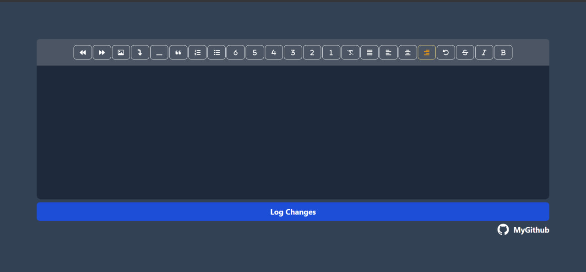

# TipTap with Next.js v13.5.4

This is a my text editor mini project [TipTap](https://rich-text-editor-one.vercel.app/). this is can help you go faster and config tiptap much faster !

## Table of contents

- [Overview](#overview)
  - [Screenshot](#screenshot)
  - [Links](#links)
- [My process](#my-process)
  - [Built with](#built-with)
  - [What I learned](#what-i-learned)
- [Author](#author)

### Screenshot



### Links

- Live Site URL: [My TipTap Editor](https://rich-text-editor-one.vercel.app/)

## My process

### Built with

- TipTap
- [TipTap](https://tiptap.dev/) - For rich text editor
- [TailwindCss](https://tailwindcss.com/) - For rich styling
- [Next.js v13.5.4](https://nextjs.org/) - The React Framework for the Web

### What I learned

I proudly learned:

- How to implement texteditor with TipTap and customize it for Next v13.5.4 app route
- Customize ProseMirror TipTap Css Classes That Work with @tailwindcss/typography
- New expreiences with conditional classes in tailwindcss

```css
.ProseMirror {
  outline: none;
  @apply max-w-full max-h-full py-6 px-4 focus:ring ring-blue-500 rounded-lg min-h-[350px] mx-auto prose-sm prose prose-p:text-white prose-strong:text-white prose-ul:px-4 prose-headings:text-white sm:prose-base lg:prose-lg xl:prose-2xl focus:outline-none;
}

.ProseMirror :where(ol > li):not(:where([class~="not-prose"] *))::marker {
  @apply text-slate-700;
}
```

```tsx
import { Color } from "@tiptap/extension-color";
import ListItem from "@tiptap/extension-list-item";
import TextStyle from "@tiptap/extension-text-style";
//@ts-ignore
import Image from "@tiptap/extension-image";
import TextAlign from "@tiptap/extension-text-align";
import { EditorContent, useEditor } from "@tiptap/react";
import StarterKit from "@tiptap/starter-kit";
import React from "react";
import MenuBar from "./MenuBar";

export default () => {
  const editor = useEditor({
    extensions: [
      Image.configure({
        HTMLAttributes: {
          class: "mx-auto w-full object-cover max-h-[300px]",
        },
      }),
      TextAlign.configure({
        types: ["heading", "paragraph"],
        defaultAlignment: "right",
      }),
      Color.configure({ types: [TextStyle.name, ListItem.name] }),
      //@ts-ignore
      TextStyle.configure({ types: [ListItem.name] }),
      StarterKit.configure({
        bulletList: {
          keepMarks: true,
          keepAttributes: false,
        },
        orderedList: {
          keepMarks: true,
          keepAttributes: false,
        },
      }),
    ],
  });

  const handleEditorChanges = () => {
    const html = editor?.getHTML();
    const json = editor?.getJSON();
    const text = editor?.getText();
    
    console.log("Html ====>", html);
    console.log("JSON ====>", json);
    console.log("Text ====>", text);
  };

  return (
    <>
      <div className="text-white rounded-xl bg-slate-800">
        <MenuBar editor={editor} />

        <EditorContent editor={editor} />
      </div>
      <button
        type="button"
        onClick={handleEditorChanges}
        className="px-5 py-2.5 my-2 text-xl font-bold text-center text-white bg-blue-700 rounded-lg focus:ring-4 focus:ring-blue-200 dark:focus:ring-blue-900 hover:bg-blue-800"
      >
        Log Changes
      </button>
    </>
  );
};
```

## Author

- LinkedIn - [@mohammadreza-khorsand](www.linkedin.com/in/mohammadreza-khorsand)
