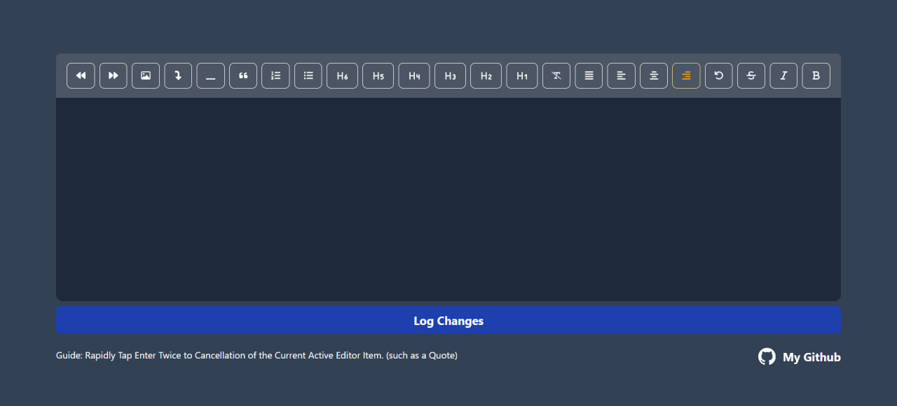

# TipTap with Next.js v13.5.4

This is a my text editor mini project [TipTap](https://rich-text-editor-one.vercel.app/). this is can help you go faster and config tiptap much faster !

## Table of contents

- [Overview](#overview)
  - [Screenshot](#screenshot)
  - [Links](#links)
- [My process](#my-process)
  - [Built with](#built-with)
  - [What I learned](#what-i-learned)
- [Author](#author)

### Screenshot



### Links

- Live Site URL: [My TipTap Editor](https://your-live-site-url.com)

## My process

### Built with

- TipTap
- [TipTap](https://tiptap.dev/) - For rich text editor 
- [TailwindCss](https://tailwindcss.com/) - For rich styling
- [Next.js v13.5.4](https://nextjs.org/) - The React Framework for the Web

### What I learned

I proudly learned:

- How to implement texteditor with TipTap and customize it for Next v13.5.4 app route
- Customize ProseMirror TipTap Css Classes That Work with @tailwindcss/typography
- New expreiences with conditional classes in tailwindcss

```css
.ProseMirror {
  outline: none;
  /* padding: 10px 10px 200px; */
  @apply max-w-full max-h-full py-6 px-4 focus:ring ring-blue-500 rounded-lg min-h-[350px] mx-auto prose-sm prose prose-p:text-white prose-strong:text-white prose-ul:px-4 prose-headings:text-white sm:prose-base lg:prose-lg xl:prose-2xl focus:outline-none;
}

.ProseMirror :where(ol > li):not(:where([class~="not-prose"] *))::marker {
  @apply text-slate-700;
}
```

```tsx
const handleEditorChanges = () => {
  const html = editor?.getHTML();
  const json = editor?.getJSON();
  const text = editor?.getText();
  console.log("Html ====>", html);
  console.log("JSON ====>", json);
  console.log("Text ====>", text);
};
```
## Author

- github - [@mohammadreza0110](https://github.com/mohammadreza0110)

